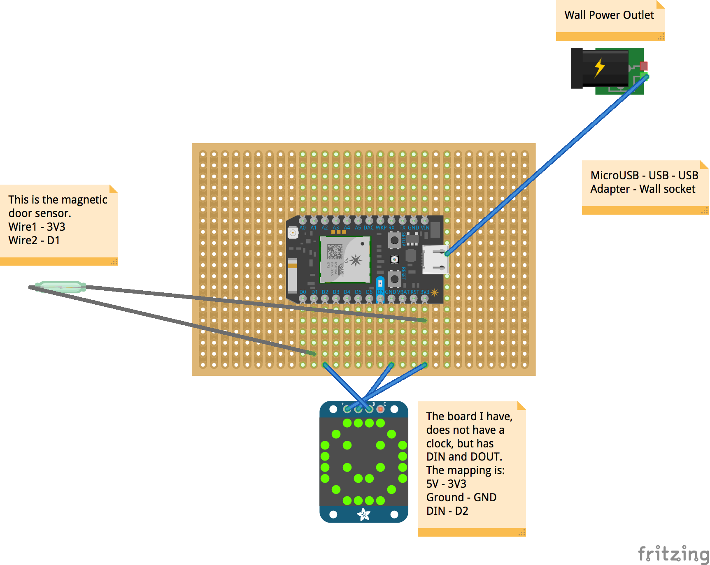
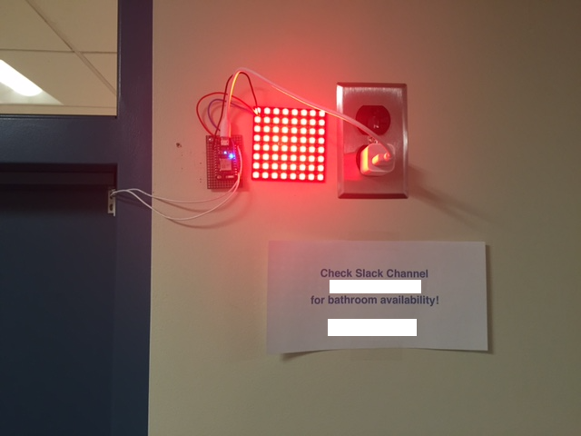
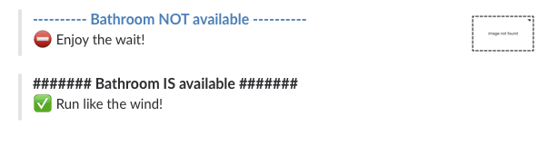

# bathroombot
Bathroom door sensor with Slack integration to notify you of bathroom availability.

### Problem
I work on a first floor of a building that only has a single bahtroom on that floor to accomodate around 30 people. Over the past few years, I've left my desk and walked to the bathroom, that's located in the middle of the hallway, only to discover that it's occupied. Given that I'm an optimist, most of the time I opted to wait as opposed to go to the second floor or next door to use the bathroom. That led to a lot of wasted time and decreased productivity and I finally decided to do something about it.

### Solution
To solve the problem, I needed the following:
  * **Door sensor** - the door is always left open when the bathroom is available.
  * **LED Light to display status** - difficulty in identitifying whether the door is open or closed unless you're really close.
  * **Digital notification in the form of an app or website** - Bathroom is in the hallway and so LED light is not visible until after you've walked out of the room and into the hallway. 

### Tools/Equipment
* [Particle Photon](https://store.particle.io/?utm_source=homesite&utm_medium=Nav&utm_campaign=TopMenu)
* [Double Sided Plated-through Holes](http://www.amazon.com/Double-Sided-Plated-through-250hole-Veroboard/dp/B00G3EHATG/ref=sr_1_1?ie=UTF8&qid=1459775299&sr=8-1&keywords=Double+Sided+Plated-through+Holes)
* [Magnetic contact switch](https://www.adafruit.com/products/375)
* [Adafruit NeoPixel NeoMatrix 8x8](https://www.adafruit.com/products/1487) - you can get something different/cheaper, but I saw another project that recommended it and I thought it looked pretty cool and I could get creative with the lights if I wanted to.
* [Hook-up Wire Spool Set](https://www.adafruit.com/products/1311) - you don't need a full spool set, but given that I was expermenting, I thought this might come in handy for other projects.
* [USB Power Adapter](http://www.amazon.com/Omni-Universal-Adapter-Charger-Samsung/dp/B00YHZI0EC/ref=sr_1_1?ie=UTF8&qid=1459776446&sr=8-1&keywords=usb+power+plug) - I had a spare Apple one that I used.
* Power plug close to where you plan on mounting the device.

I did not list the soldering iron and solder as I was lucky to have a co-worker who has all this and taught me how to solder and test the connections. 

I would recommend getting the [Particle Maker Kit](https://store.particle.io/?utm_source=homesite&utm_medium=Nav&utm_campaign=TopMenu) as it contains a breadboard and some other stuff that you can tinker with.

### Wiring Diagram

### Why Slack?
Simple answer is that we are already using it and it felt it would be easiest for everyone since we all have the app and you'd just need to subscribe to the channel.

### Slack integration
Particle Photon is web enabled (you will need to make sure it's configured on your network) and can be programmed to post events to [Particle's site](https://dashboard.particle.io/). Before messing around with the slack integeration, make sure to have the following completed:
* Photon is on wireless network
* Photon's firmware is flashed with provided [code](https://github.com/shaidar/bathroombot/blob/master/bathroombot.ino)
* Photon is connected based on diagram above and LED is acting as expected (red when switch is closed and green when open)
* Photon is proerly logging events in dashboard

Once you have all the above in place, you can work on the slack integration. I used [IFTTT](https://slack.com/apps/A028LGAFF-ifttt) which also integrates with [Particle](https://www.particle.io/ifttt).

### Finished Product
###### This is what it looks like

###### Messages in Slack

### Helpful Links
* Online store and a lot of interesting projects - [Adafruit](https://www.adafruit.com)
* App to diagram connections - [Fritzing](http://fritzing.org/home/)
* [Instructables Bathroom Indicator project](http://www.instructables.com/id/IoT-Bathroom-Vacancy-Indicator-For-Hackers/)
* [Is toilet free](https://madebymany.com/blog/is-the-toilet-free)
